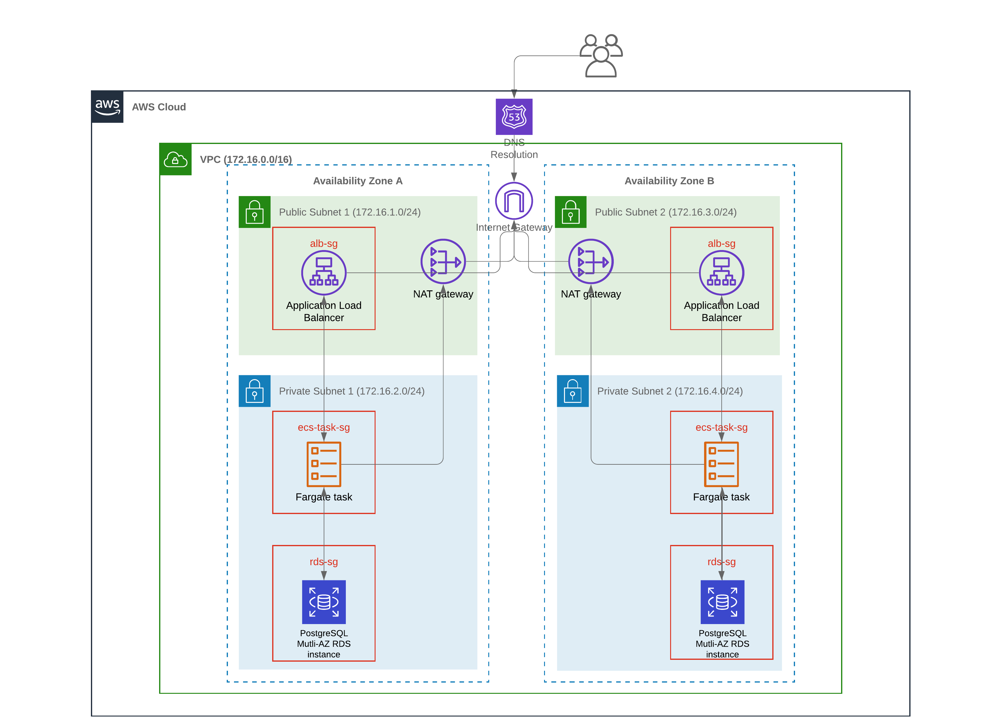

# aws-ecs-ha-app

This is a repository for my personal project of setting up a high availability application on AWS ECS Fargate.

A rough diagram of the infrastructure is below.

todo:

- setup proper error handling for app
- fix db tables not being created
- write up infra in terraform