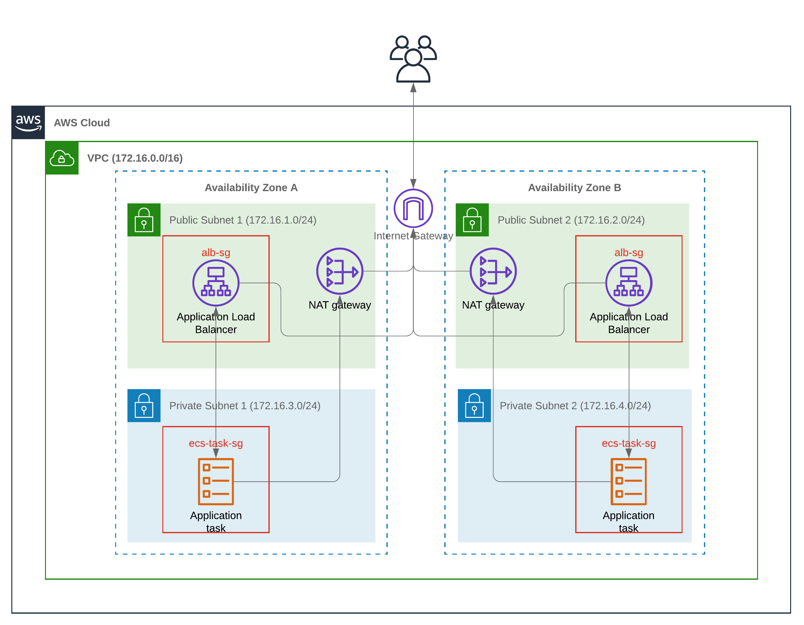

# aws-ecs-ha-app

This is a repository for my personal project of setting up high availability 'hello-world' application on AWS Fargate with terraform, using a GitLab CI/CD pipeline for deployment.

A rough diagram of the infrastructure is below.

A rough diagram of the CI/CD pipeline is below.

the docker image for this application is [here](https://hub.docker.com/r/joelfreeman/aws-ecs-app).